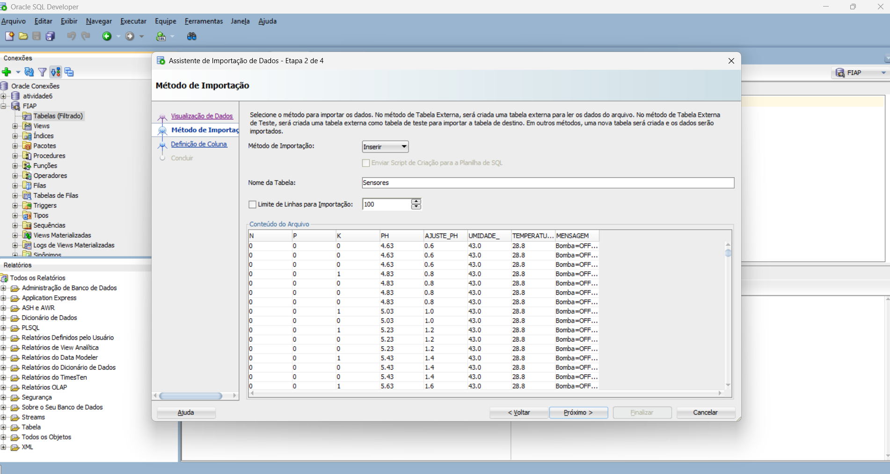

# FIAP - Faculdade de Informática e Administração Paulista


<a href= "https://www.fiap.com.br/"></a>
</p>

<br>


# 📊 Fase 3 – 1TIAOS – Capítulo 1

## **Etapas de uma Máquina Agrícola**

### 👨‍💻 Aluno

* [**Silvio Prestes Guerreiro Junior**](https://www.linkedin.com/in/silvio-guerreiro-junior/)
* **Matrícula:** RM567958

### 👩‍🏫 Professores

* **Tutor(a):** Sabrina Otoni
* **Coordenador(a):** André Godoi Chiovato

---

## 📡 Visão Geral do Projeto

Este projeto integra a **Fase 3 do curso 1TIAOS – FIAP**, no contexto do **Capítulo 1: Etapas de uma Máquina Agrícola**.
O objetivo foi **importar, tratar e analisar dados de sensores agrícolas no Oracle Database**, assegurando a **integridade, precisão e coerência dos valores originais** obtidos na **Fase 2 – Capítulo 1 do projeto Farm Tech Solutions**.

Os dados coletados representam medições de sensores de:

* **pH** e **ajuste de pH**;
* **Umidade relativa do ar**;
* **Temperatura ambiente**;
* **Nutrientes N, P e K** (nitrogênio, fósforo e potássio).

Essas variáveis são essenciais para o **controle automatizado de irrigação e monitoramento ambiental** em lavouras inteligentes.

---

## 🧠 Origem dos Dados

Os dados foram **extraídos diretamente do terminal do Visual Studio Code (VS Code)** durante a execução da simulação da Fase 2, utilizando o **simulador Wokwi** com:

* Microcontrolador **ESP32**
* Sensor **DHT22**
* Sensor de **pH**
* **Módulo relé**

Etapas do processo:

1. Execução do código no VS Code e cópia das saídas do terminal;
   

2. Salvamento dos dados em **planilha Excel** (`Sensores_limpo.xlsx`);

3. Importação para o **Oracle SQL Developer**.

**Exemplo de leituras registradas:**

```
N=0 P=0 K=0 | pH=4.41 | Ajuste pH=0.0 | Umi=40.0% | Temp=24.8C | Bomba=OFF -> pH fora (alvo 5.5–6.8)
N=0 P=0 K=0 | pH=5.55 | Ajuste pH=0.0 | Umi=40.0% | Temp=24.8C | Bomba=OFF -> aguarda: Umi <55% e Temp >=40C
```

---

## ⚙️ Objetivos Técnicos

* Preservar a **precisão decimal** dos dados originais durante a importação;
* Evitar **erros de conversão e precisão** (`ORA-00957`, `ORA-01438`);
* Garantir a **correspondência entre tipos de dados** da planilha e do Oracle;
* Executar **consultas SQL analíticas** sobre o conjunto de dados importado.

---

## 🧱 Estrutura da Tabela `SENSORES`

### 📄 Criação da Tabela

```sql
CREATE TABLE SENSORES (
  N              NUMBER(1),
  P              NUMBER(1),
  K              NUMBER(1),
  PH             NUMBER(3,2)     NOT NULL,
  AJUSTE_PH      NUMBER(3,2),
  UMIDADE_       NUMBER(3,1),
  TEMPERATURA_C  NUMBER(3,1),
  MENSAGEM       VARCHAR2(77 CHAR)
);
```


### 🔧 Ajustes de Precisão e Escala

```sql
ALTER TABLE SENSORES MODIFY (PH             NUMBER(4,2));
ALTER TABLE SENSORES MODIFY (AJUSTE_PH      NUMBER(4,2));
ALTER TABLE SENSORES MODIFY (UMIDADE_       NUMBER(5,2));
ALTER TABLE SENSORES MODIFY (TEMPERATURA_C  NUMBER(5,2));
ALTER TABLE SENSORES MODIFY (N NUMBER(10,0));
ALTER TABLE SENSORES MODIFY (P NUMBER(10,0));
ALTER TABLE SENSORES MODIFY (K NUMBER(10,0));
```


---

## 🧩 Dificuldades e Soluções

| Dificuldade                                            | Causa                                         | Solução                                            |
| ------------------------------------------------------ | --------------------------------------------- | -------------------------------------------------- |
| **Perda de casas decimais (4.63 → 463)**               | Separador decimal incorreto                   | `ALTER SESSION SET NLS_NUMERIC_CHARACTERS = '.,';` |
| **ORA-00957: nome de coluna duplicado**                | Criação automática duplicou `PH`              | Criação manual da tabela                           |
| **ORA-01438: valor maior que a precisão especificada** | Tipos numéricos insuficientes (`NUMBER(3,1)`) | Alteração para `NUMBER(4,2)`                       |
| **Tipos incorretos ao importar**                       | Wizard padrão usa `NUMBER(38,0)`              | Ajuste manual dos tipos antes da importação        |

---

## 📥 Etapas do Processo

1. **Configuração inicial da sessão**

   ```sql
   ALTER SESSION SET NLS_NUMERIC_CHARACTERS = '.,';
   ```

   

2. **Criação da tabela com tipos ajustados.**

3. **Importação da planilha Excel:**
   

   * Método: *Insert into existing table*
   * Conferência de tipos e precisão numérica.

4. **Validação pós-importação:**

   ```sql
   SELECT * FROM SENSORES FETCH FIRST 10 ROWS ONLY;
   ```

---

## 🔍 Consultas SQL Funcionais

### 1️⃣ Leituras gerais

```sql
SELECT * FROM SENSORES FETCH FIRST 20 ROWS ONLY;
```


### 2️⃣ Leituras com pH fora da faixa ideal (5,5–6,8)

```sql
SELECT N, P, K, PH, AJUSTE_PH, MENSAGEM
FROM SENSORES
WHERE PH < 5.5 OR PH > 6.8;
```


### 3️⃣ Situações de emergência (≥40°C e umidade <55%)

```sql
SELECT N, P, K, PH, UMIDADE, TEMPERATURA_C, MENSAGEM
FROM SENSORES
WHERE TEMPERATURA_C >= 40 AND UMIDADE < 55;
```


### 4️⃣ Médias gerais

```sql
SELECT
  ROUND(AVG(PH),2) AS PH_MEDIO,
  ROUND(AVG(UMIDADE),2) AS UMIDADE_MEDIA,
  ROUND(AVG(TEMPERATURA_C),2) AS TEMP_MEDIA
FROM SENSORES;
```


### 5️⃣ Diagnóstico automatizado

```sql
SELECT
  N, P, K, PH, AJUSTE_PH, UMIDADE, TEMPERATURA_C,
  CASE
    WHEN TEMPERATURA_C >= 40 AND UMIDADE < 55 THEN 'EMERGÊNCIA: calor extremo (>=40°C e umidade <55%)'
    WHEN PH < 5.5 OR PH > 6.8 THEN 'ALERTA: pH fora da faixa ideal (5,5–6,8)'
    ELSE 'CONDIÇÃO NORMAL'
  END AS DIAGNOSTICO
FROM SENSORES;
```


---

## 📈 Resultados Obtidos

| N | P | K | PH   | AJUSTE_PH | UMIDADE_ | TEMPERATURA_C | MENSAGEM                                                     |
| - | - | - | ---- | --------- | -------- | ------------- | ------------------------------------------------------------ |
| 0 | 0 | 0 | 4.63 | 0.60      | 43.00    | 28.80         | Bomba=OFF → pH fora (alvo 5.5–6.8)                           |
| 0 | 0 | 0 | 6.53 | 1.60      | 39.50    | 42.60         | Bomba=ON → EMERGÊNCIA: calor extremo (>=40°C e umidade <55%) |

✅ Dados importados corretamente
✅ Precisão decimal preservada
✅ Consultas executadas com sucesso

---

## 💡 Conclusão

O processo evidenciou a importância de:

* Configurar corretamente a sessão (`NLS_NUMERIC_CHARACTERS`);
* Ajustar a precisão dos campos decimais;
* Tratar erros de importação e validar a integridade dos dados após a carga.

Os dados simulados no **VS Code** e gerados pelo **simulador Wokwi (Fase 2 – Farm Tech Solutions)** foram **convertidos e analisados com sucesso** no **Oracle Database**, mantendo total fidelidade às medições originais.

---

## 🗃 Histórico de Versões

| Versão    | Data       | Descrição                                           |
| --------- | ---------- | --------------------------------------------------- |
| **1.0.0** | 12/11/2025 | Inclusão da origem dos dados e revisão final.       |
| **0.9.0** | 11/11/2025 | Correção de erros ORA e ajustes de tipos numéricos. |
| **0.8.0** | 10/11/2025 | Importação inicial e testes de precisão.            |
| **0.7.0** | 09/11/2025 | Criação da estrutura e ambiente Oracle.             |

---

## Link Video

https://youtu.be/ZV3UsOPT4Vw

---

## 📋 Licença

Projeto desenvolvido para fins **acadêmicos** – **FIAP**.
Reprodução e redistribuição restritas ao **contexto educacional**.
